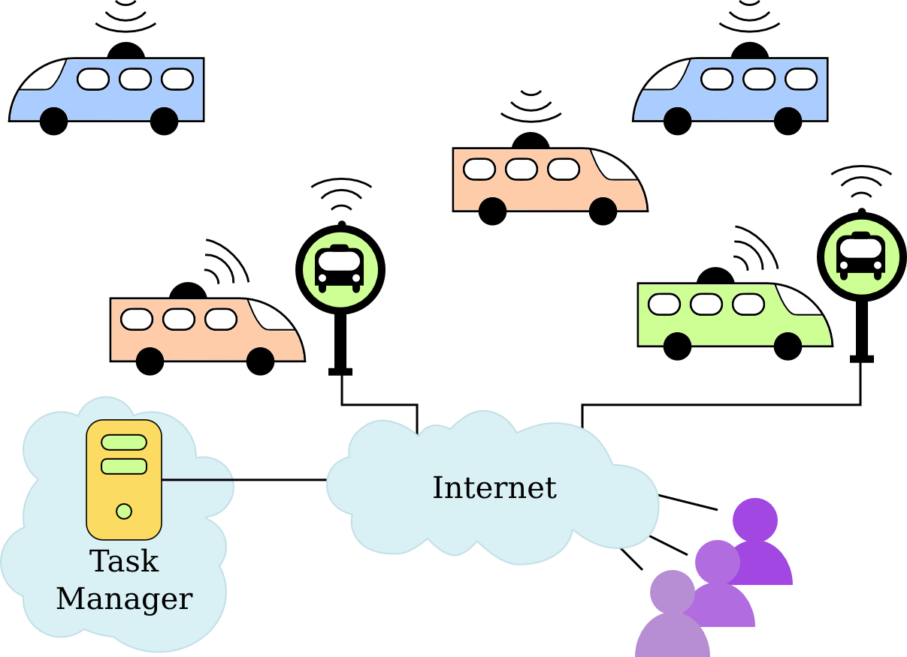
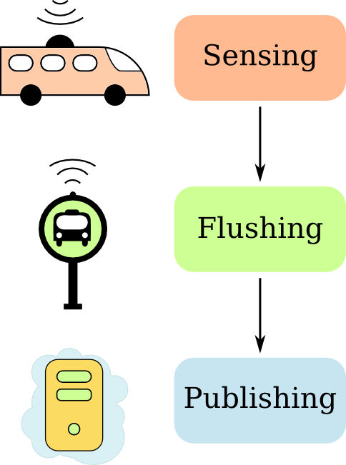
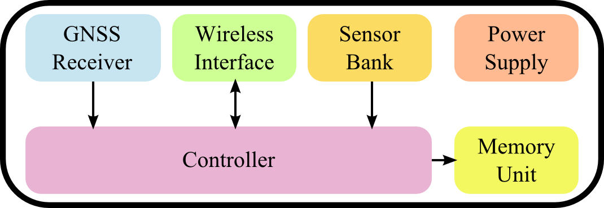

# Sensing_bus
Urban Sensing Through Bus-Based Mobility

This project is a bus-based sensing platform for Smart Cities. In a broader view, sensor nodes, embbeded onto buses, gather data about the city. Such data is delivered to users using access points mounted into the bus stops of the city. Data is presented to users using a cloud service. The whole schema is shown below: 

The schema is abstracted in three layers: sensing, flushing, and publishing. These layers are mapped into the architecture of the current project.

## Architecture
This project has three main layers, as shown:

The Sensing layer is responsible for gathering raw data from the city. It is composed by wireless sensor nodes embbeded onto urban buses of public transportation.

The Flushing layer receives raw data directly from the Sensing layer and sends it to the Publishing layer, through the Internet. It is composed by access points, mounted on bus stops.

The Publishing layer receives data from all the nodes in the Flushing layer and serves data to the users, using an API and a web interface. This layer is composed by a server running on a distributed cloud.

Each layer is a component of this project, as explained in detail throughout the next sections.

### Sensing layer
The Sensing layer is a mobile wireless sensor network that gathers data from the city, using buses as mobility platform. Every node in this network is capable of gathering data, storing it and send it to the Flushing layer.

There should be one node per bus.

#### The Sensing Node

Every sensing node is cabable of gathering data, storing and transmitting it to a Flushing node. The Sensing Node follows an architecture presented [here](http://www.gta.ufrj.br/ftp/gta/TechReports/CPCC16.pdf) and ilustrated here:

The devices used to implement each module are on teh following table:

| Module                 | Device         | Manufacturer    |
|------------------------|----------------|-----------------|
| Controller             | Arduino UNO R3 | Arduino         |
| GNSS Receiver          | GS-96U7        | Guangzhou Xintu |
| SD Card Interface      | GS-96U7        | Guangzhou Xintu |
| Wireless Interface     | ESP8266        | Espressif       |

The sensor bank has the following sensors:

| Sensor                 | Device         | Manufacturer    |
|------------------------|----------------|-----------------|
| Humidity               | DHT11          | DFRobot         |
| Temperature            | DHT11          | DFRobot         |
| Light Intensity        | GL5528         | GBK Robotics    |
| Rain Intensity         | YL-38          | 100y            |

The Controller and Wireless Interface are programmable devices. In the folder "sensing" of the current project, the codes used in each of them can be found.

### The Flushing layer
<!-- This section must explain what is the flushing layer. What are its tasks inside the environment. -->

#### The Flushing node
<!-- This section must explain what is the flushing node. How does it work? What are the technologies involved?-->

### The Publishing layer
<!-- This section must explain what is the publishing layer. What are its tasks inside the environment. -->
The Publishing layer receives the data from Flushing layer and publishes the data to the users. Users can obtain data in two ways:

- Receiving data through an API;
- Visualizing data on a map generated by a web service.

The Publishing layer is implemented as a single Publishing node, explained in the following session.

#### The Publishing node
The Publishing Node is a web service powered by [Django](https://www.djangoproject.com/). The visualizing platform is implemented with [Bootstrap](http://getbootstrap.com/) and with [Google Maps API](https://developers.google.com/maps/). The Publishing Node runs on a cloud platform, described [here](http://www.gta.ufrj.br/ftp/gta/TechReports/CSB15.pdf).

#### The Publishing API
The publishing API offers the retrieval of measurements using filters. A user requests measurements with the HTTP GET method. The GET parameters are the filters applied to the data being queried. The possible filters are:

- **bus_id**: Selects measurements from the bus identified by **bus_id**;
- **start_time**: Selects measurements older than **start_time**;
- **end_time**: Selects measurements newer than **end_time**;
- **sensor_name**: Selects measurements from specified sensor;
- **min_lat**: Selects measurements with latitudes bigger than **min_lat**;
- **max_lat**: Selects measurements with latitudes smaller than **max_lat**;
- **min_lng**: Selects measurements with longitudes bigger than **min_lng**;
- **max_lng**: Selects measurements with longitudes smaller than **max_lng**;

An example url is www.your-website.com/data?bus_id=123&sensor_name=temperature
